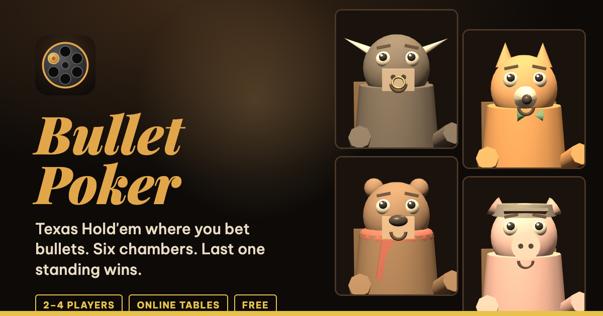

# Bullet Poker



Texas Hold'em where you bet **bullets**, not chips. A 3D bluffing game that runs in the browser, inspired by the mood of *Liar's Bar*.

**Play:** https://silky-itt.github.io/bulletpoker/

- 2–4 players online, each on their own device: host a table, share the code or link, or pick one from the open tables list
- Six-chamber revolver: fold or lose the showdown and you pull the trigger with the bullets you loaded
- Switch and Coward's Fold, once per match
- Low-poly animal characters with expressive faces
- Synthesized adaptive music and sound effects (Web Audio, no asset files)

## Run locally
No build step. Serve the folder with any static server:

```sh
python3 -m http.server 8000
# open http://localhost:8000
```

## Files
| File | Purpose |
|---|---|
| `index.html` | HUD, character select, input |
| `engine.js` | Cards, hand evaluator, Monte Carlo equity |
| `game.js` | Rules and turn flow (no DOM) |
| `scene.js` | Three.js scene, characters, camera |
| `audio.js` | Web Audio music and SFX |
| `net.js` | Online tables: MQTT lobby + PeerJS game traffic |
| `DESIGN.md` | Design bible: visuals, UX, audio, rules |
| `assets/` | Site icon (SVG + PNG sizes) and the link-preview image |

Three.js r128 (cdnjs), PeerJS 1.5.4 (jsDelivr) and MQTT.js 5.10.1 (unpkg) are loaded from CDNs.
